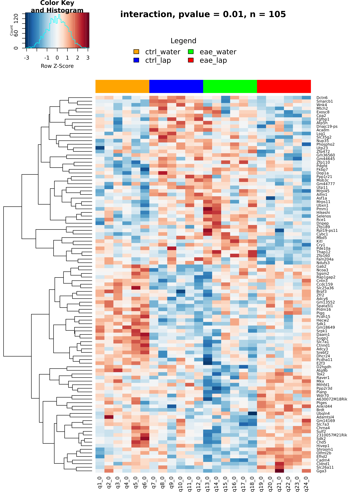
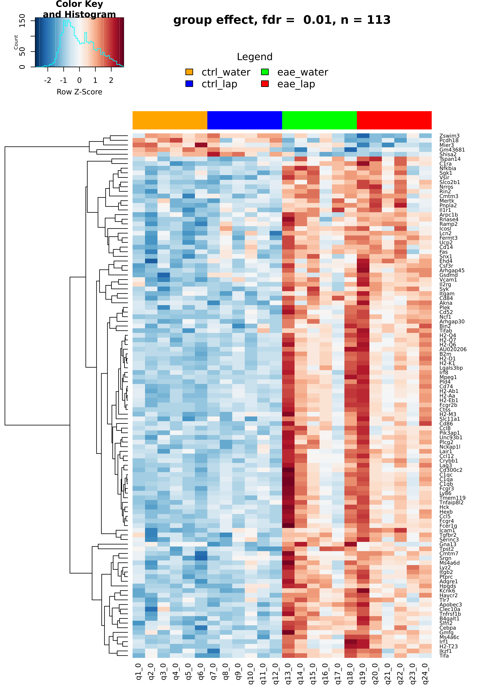
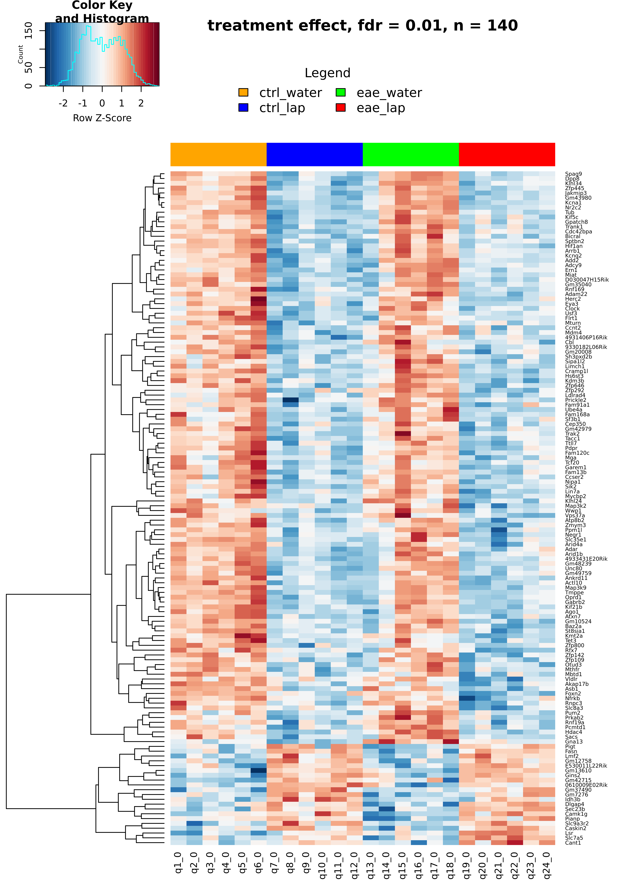
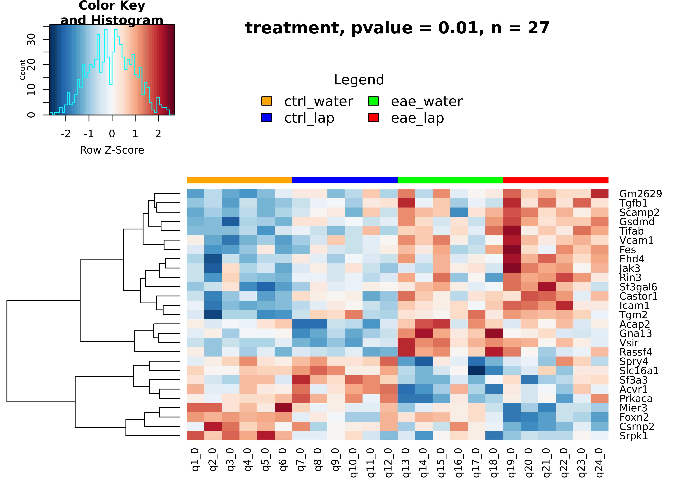
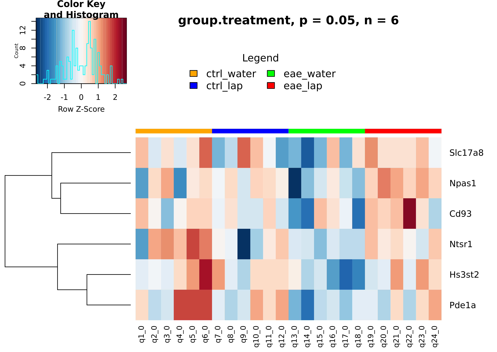
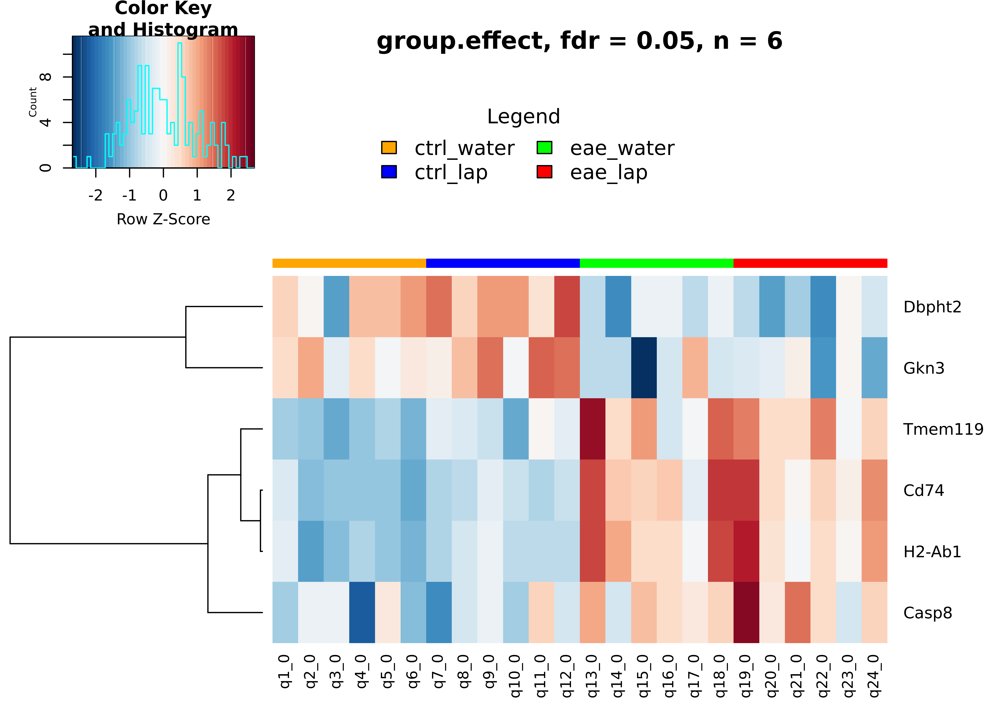
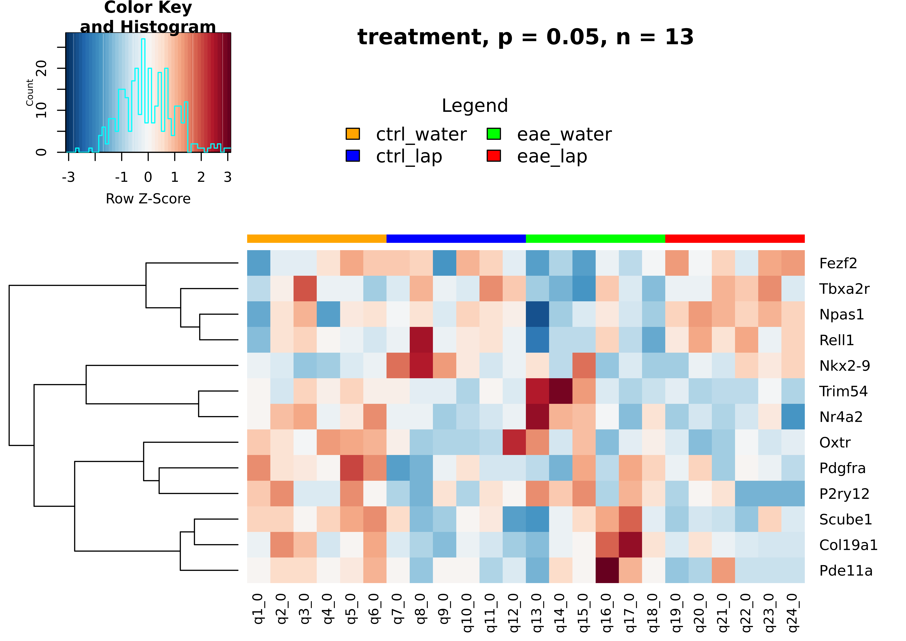
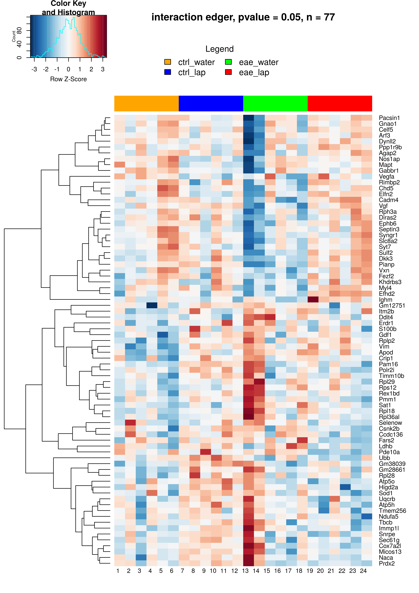
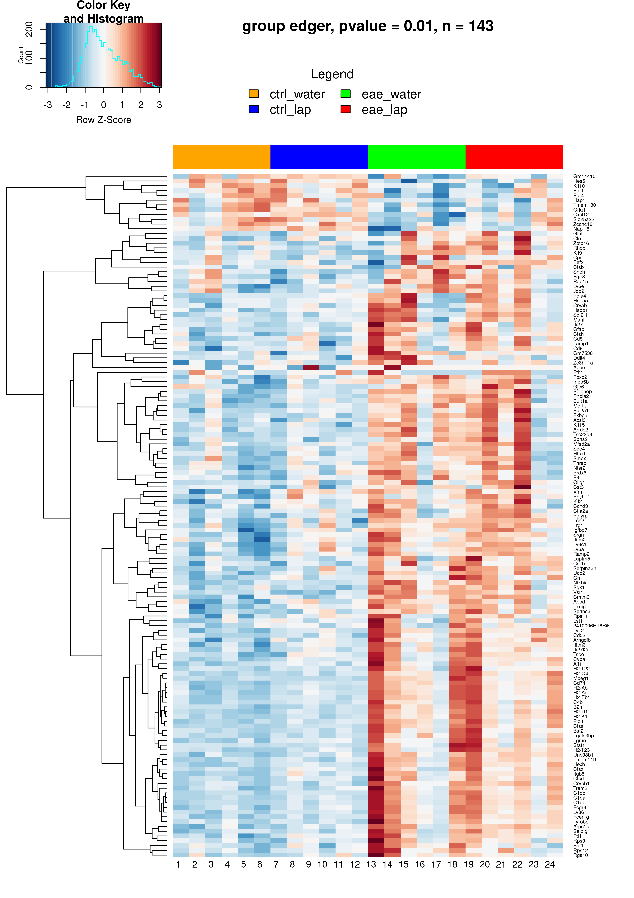
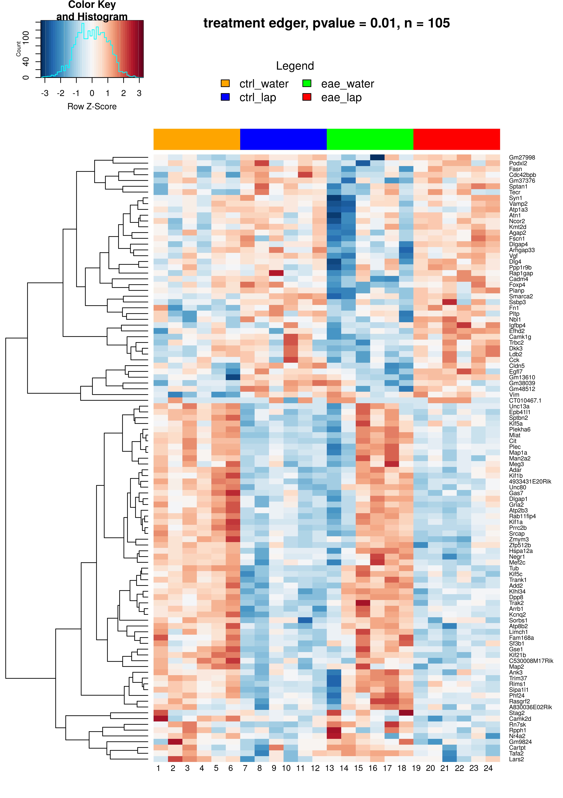

# ifpan-nalepa-smog

1. QC control of Fastq files:
``` 
RNA_FILES=`ls */*/*/*gz`
echo $RNA_FILES | tr -s ' \011' '\012' | head -n 20 | tail -n 10 | xargs -i docker run -d --rm -v $PWD:/data pegi3s/fastqc /data/{}
```

2. MultiQC to generate a full report:
```
docker run --rm -v $PWD:/data ewels/multiqc:latest multiqc /data -o /data
```

3. Mus musculus reference genomes was downloaded from Ensmbl (release 102), and indexed with Hisat2:

4. Alignement for a single sample:
```
ls */*/*/*gz | cut -d "/" -f 4 | cut -d "_" -f 1 | uniq >> sample-list.txt

cat sample-list.txt | head -2 | xargs -I {} docker run --rm -v $PWD:/data zlskidmore/hisat2:2.1.0 hisat2 -x /data/index/genome -1 /data/X201SC20111890-Z01-F001/raw_data/{}/{}_1.fq.gz -2 /data/X201SC20111890-Z01-F001/raw_data/{}/{}_2.fq.gz -S /data/{}.sam --summary-file /data/{}.txt --dta-cufflinks

```
5. Convert sam to bam
```
cat sample-list.txt | head -6 | xargs -I {} docker run -d --rm -v $PWD:/data zlskidmore/samtools:1.9 samtools sort -O bam -T /data/$FILE.sort -o /data/{}.bam /data/{}.sam
```
6. Run cuffcuant:

```
cat sample-list.txt | head -6 | xargs -I {} docker run -d --rm -v $PWD:/data octavianus90/cufflinks_final:latest cuffquant -o /data/{}.cuant /data/Mus_musculus.GRCm38.102.gtf /data/{}.bam
```


Preparation of marker genes:

The marker genes were [taken from](http://mousebrain.org/celltypes/?fbclid=IwAR2uLbp0fYm2Eaet7l_vz9OYeoTIV_qByP6eEddBvwIx6-55GKGnHu5TaiQ), extract need information and save to [gene-marers.tsv](https://github.com/ippas/ifpan-nalepa-smog/blob/main/gene-markers.tsv):

``` 
cat gene-markers.txt | 
    cut -f1,3,5,7,8 | 
    awk -F"\t" -v OFS="\t" '{print $1, $2, $3, $4"_"$5}' | 
    tail +2 | 
    sed 's/\t/;/' | 
    awk -F"\t" -v OFS="\t" '{print $1, $3, $2}' | 
    awk -F"\t" 'BEGIN {OFS="\t"} {gsub(" ", ";", $1); print}' | 
    awk -F"\t" 'BEGIN {OFS="\t"} {gsub(" ", ";", $2); print}' | 
    sed 's/ /\t/g' | 
    awk -F"\t" -v OFS="\t" '{print $1, $2, $3"\n"$1, $2, $4"\n"$1, $2, $5"\n"$1, $2, $6"\n"$1, $2,  $7"\n"$1, $2, $8"\n"$1, $2,  $9}' | 
    awk '$3!=""' | 
    sed 's/;/ /g' | 
    sed 's/ /\t/' | 
    sed 's/_/\t/g' | 
    awk 'BEGIN{print "symbol\tdescription\tregion\tmarker\tlocation"}1' -> gene-markers.tsv
```

Analysis in R version 3.4.4
[analysis.R](https://github.com/ippas/ifpan-nalepa-smog/blob/main/analysis.R) executes:
- load the necessary data from files: [full-sample-info.csv](https://github.com/ippas/ifpan-nalepa-smog/blob/main/full-sample-info.csv),  [genes.fpkm_table](https://github.com/ippas/ifpan-nalepa-smog/blob/main/genes.fpkm_table), [mart_export.txt](https://github.com/ippas/ifpan-nalepa-smog/blob/main/mart_export.txt)
- performs fpkm data transformations log<sub>2</sub>(x + 1) 
- performs a two-way ANOVA on fpkm.log and execute fdr on p-value
- writes sample information to [full-sample-info.csv](https://github.com/ippas/ifpan-nalepa-smog/blob/main/full-sample-info.csv), fpkm data after transforming to [fpkms-log.csv](https://github.com/ippas/ifpan-nalepa-smog/blob/main/fpkms-log.csv) and results from two-way ANOVA to [two-way-anova-results.csv](https://github.com/ippas/ifpan-nalepa-smog/blob/main/two-way-anova-results.csv)
- creates heatmaps for genes from the interaction of group effect and treatment effect







- after performing two-way ANOVA, filters genes with fdr < 0.05 for group effect, then creates a heatmap for genes for which p-value < 0.05 from the group effect



- For the resulting four lists of genes, it downoloads information from databases: WikiPahtway_2021_Human, KEGG_2021_Human, GO_Biological_Process_2021, GO_Molecular_Function_2018, Descartes_Cell_Types_and_Tissue_2021. The data is saved according to: [enrichR-gene-interaction.tsv](https://github.com/ippas/ifpan-nalepa-smog/blob/main/enrichR-gene-interaction.tsv), [enrichR-gene-group-effect.tsv](https://github.com/ippas/ifpan-nalepa-smog/blob/main/enrichR-gene-group-effect.tsv), [enrichR-gene-treatment-effect.tsv](https://github.com/ippas/ifpan-nalepa-smog/blob/main/enrichR-gene-interaction.tsv), [enrichR-gene-group-effect-secondstage.tsv](https://github.com/ippas/ifpan-nalepa-smog/blob/main/enrichR-gene-group-effect-secondstage.tsv)

- loads the [gene-markers.tsv]() with a marker genes
- for makrer genes performs statistics with correction of fdr on p-value from the interaction of group effect and treatment effect
- creates heatmaps for genes from the interaction of group effect and treatment effect








Analysis using the edgeR package in R version 3.6.3
[edgeR-analysis.R](https://github.com/ippas/ifpan-nalepa-smog/blob/main/edgeR-analysis.R) executes:
- load the necessary data from files: [full-sample-info.csv](https://github.com/ippas/ifpan-nalepa-smog/blob/main/full-sample-info.csv),  [genes.fpkm_table](https://github.com/ippas/ifpan-nalepa-smog/blob/main/genes.fpkm_table), [mart_export.txt](https://github.com/ippas/ifpan-nalepa-smog/blob/main/mart_export.txt)
- performs statistics usung the [edgeR package](https://www.bioconductor.org/packages/release/bioc/vignettes/edgeR/inst/doc/edgeRUsersGuide.pdf)
- creates heatmaps for genes from the interaction of group effect and treatment effect
- for the selected genes, performs a heatmap for the interaction, group effect and treatment effect. Performs heatmaps using fpkm data transformations log<sub>2</sub>(x + 1) 








